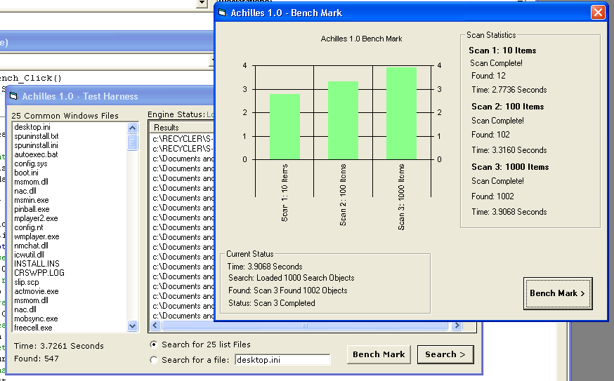



## Last: Achilles 1\.5 \- Multi\-Threaded Recursive File Search Engine

### Description

The fastest file searching engine you will ever see in vb! Uses Async multithreading, collabsable events forwarding, bi-directional collection exchanges, and the fastest recursion loop you will ever see!

Two modes multi - passes a collection object into the active-x server, which launches a recursion class asynchronously. Class builds a collection with a lightning fast recursive loop, then passes object back to processing hub where two collections are compared and results passed back to caller as a new collection.

Collection lookups are done using keys, and are lightning fast!

The beauty of this method, is when passing many search items, there is only a small initial lag during recursion, (about one second for 25 thousand files!), then results object is built as fast as key lookups can be made.

Second method - pass a single file into a stripped down recursion loop, and it returns all matches and file properties, (less then a second for my full 4G partition).

----

I was suprised that this did not get more attention.. and was thinking perhaps people just don't realize how fast this really is.. So I made a benchmarking form that demonstrates the incredible power of this control. In my tests, there is no significant increase in time required to search for 10 items or a 1000 items..

A benchmark on my measly 1Ghz box, searched for 10,000 items across entire 4G drive in less then 10 seconds!

Take another look people, this is pretty innovative piece of software here..

----

Added more optimizations, fixed a few details, and added a process/thread acceleration switch that raises execution up to realtime priority.

----

Made more optimizations, a couple fixes, (like accelerate enum), a very cool demo for this is in the works..

----

Ver 1.5 is up, enjoy..

See ya..

John
 
### More Info
 

             |
---                |---
**Submitted On**   |2006-01-07 12:53:30
**By**             |[Steppenwolfe](https://github.com/Planet-Source-Code/PSCIndex/blob/master/ByAuthor/steppenwolfe.md)
**Level**          |Intermediate
**User Rating**    |5.0 (100 globes from 20 users)
**Compatibility**  |VB 5\.0, VB 6\.0
**Category**       |[Complete Applications](https://github.com/Planet-Source-Code/PSCIndex/blob/master/ByCategory/complete-applications__1-27.md)
**World**          |[Visual Basic](https://github.com/Planet-Source-Code/PSCIndex/blob/master/ByWorld/visual-basic.md)
**Archive File**   |[Last\_\_Achi196336172006\.zip](https://github.com/Planet-Source-Code/steppenwolfe-last-achilles-1-5-multi-threaded-recursive-file-search-engine__1-63601/archive/master.zip)

